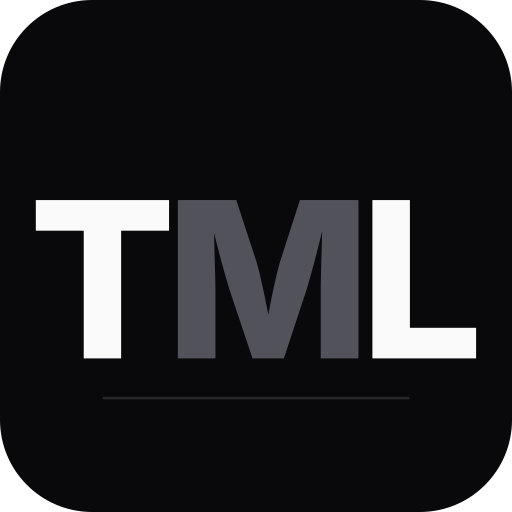
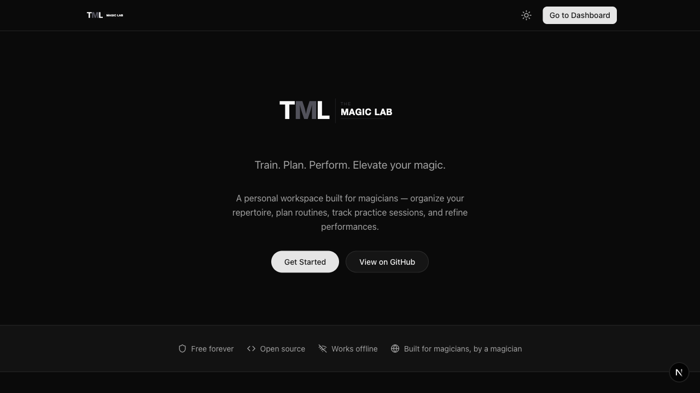

<p align="center">
  
</p>

<h1 align="center">The Magic Lab</h1>

<p align="center">
  <strong>Train. Plan. Perform. Elevate your magic.</strong>
</p>

<p align="center">
  <a href="https://github.com/julienroussel/tml/actions/workflows/ci.yml"></a>
  <a href="LICENSE"></a>
  
</p>

<p align="center">
  A free, open-source workspace for magicians — organize your repertoire, plan setlists, track practice sessions, and refine performances. Works offline, syncs across devices.
</p>

<p align="center">
  <a href="https://themagiclab.app/">Website</a> · <a href="docs/">Documentation</a> · <a href="https://github.com/julienroussel/tml/issues">Issues</a>
</p>

<p align="center">
  
</p>

## Features

- **Improve** -- Log practice sessions and track your progress on individual sleights, moves, and techniques.
- **Train** -- Set goals, build drills, and stay consistent with structured practice.
- **Plan** -- Assemble and fine-tune your setlists, from a quick close-up set to a full stage show.
- **Perform** -- Keep notes on your performances, track audience reactions, and learn from every show.
- **Enhance** -- Discover insights, revisit what works, and continuously raise the bar.
- **Collect** -- Register and organize your props, books, gimmicks, and other items.

## Tech Stack

- [Next.js 16](https://nextjs.org/) with App Router
- [React 19](https://react.dev/) with React Compiler
- [Tailwind CSS v4](https://tailwindcss.com/) for styling
- [shadcn/ui](https://ui.shadcn.com/) component primitives (Radix UI)
- [Neon Postgres](https://neon.tech/) serverless database
- [PowerSync](https://www.powersync.com/) offline-first sync engine
- [Neon Auth](https://neon.tech/docs/guides/neon-auth-guide) for authentication (email OTP + Google)
- [Drizzle ORM](https://orm.drizzle.team/) for type-safe SQL
- [next-intl](https://next-intl.dev/) for internationalization (7 locales)
- [React Email](https://react.email/) + [Resend](https://resend.com/) for transactional emails
- [Vitest](https://vitest.dev/) + [Playwright](https://playwright.dev/) for testing
- [Biome](https://biomejs.dev/) via [Ultracite](https://github.com/haydenbleasel/ultracite) for linting and formatting
- PWA support with offline access and push notifications

## Getting Started

### Prerequisites

- Node.js 24.x ([nvm](https://github.com/nvm-sh/nvm) or [fnm](https://github.com/Schniz/fnm) recommended)
- pnpm >= 10 (`corepack enable && corepack prepare pnpm@latest --activate`)

### Setup

```bash
git clone https://github.com/julienroussel/tml.git
cd tml
pnpm install
pnpm setup          # configure environment
pnpm dev            # start dev server (https://localhost:3000)
```

## Scripts

```bash
# Development
pnpm dev              # Start dev server (Turbopack, HTTPS)
pnpm build            # Production build
pnpm start            # Start production server

# Code quality
pnpm lint             # Lint and format check (Ultracite/Biome)
pnpm fix              # Auto-fix lint and format issues
pnpm typecheck        # TypeScript type checking

# Testing
pnpm test             # Run unit tests in watch mode (Vitest)
pnpm test:run         # Run unit tests once
pnpm test:coverage    # Run unit tests with coverage
pnpm test:ui          # Open Vitest UI
pnpm test:e2e         # Run E2E tests (Playwright)
pnpm test:e2e:ui      # Open Playwright UI mode

# Database
pnpm db:generate      # Generate Drizzle migration from schema changes
pnpm db:migrate       # Apply pending migrations to Neon
pnpm db:studio        # Open Drizzle Studio GUI

# i18n & docs
pnpm i18n:check       # Validate all locales have matching keys
pnpm docs:generate    # Regenerate llms.txt files from docs/

# Other
pnpm email:dev        # Start email template dev server
pnpm screenshots      # Regenerate PWA manifest screenshots
pnpm setup            # Initial project setup
```

## Project Structure

```
src/
  app/                    # Next.js App Router
    (marketing)/[locale]/ # Public pages (landing, FAQ, privacy) — statically generated per locale
    (app)/                # Authenticated app (dashboard, modules)
    auth/                 # Sign-in / sign-up (dynamic, locale-aware)
    api/                  # API routes (auth, sync, email, cron)
  features/               # Feature modules (improve, train, plan, ...)
    <module>/components/  # Module-specific components
    <module>/hooks/       # Module-specific hooks
  components/             # Shared React components
    ui/                   # shadcn/ui primitives
  db/                     # Drizzle schema, migrations
  sync/                   # PowerSync offline-first sync engine
  i18n/                   # Internationalization (7 locales)
  emails/                 # Transactional email templates
  hooks/                  # Shared React hooks
  lib/                    # Utilities, modules, config
  test/                   # Test utilities, factories, mocks
docs/                     # Architecture and design documentation
public/                   # Static assets, service worker
scripts/                  # Build and generation scripts
```

## Architecture

The Magic Lab is an offline-first progressive web app (PWA). Data lives in a local SQLite database (via WASM) in the browser, synced bidirectionally with Neon Postgres through PowerSync Cloud. Authentication uses Neon Auth with email OTP and Google social login.

For detailed documentation, see the [docs/](docs/) directory — covering [architecture](docs/architecture.md), [data model](docs/data-model.md), [sync engine](docs/sync-engine.md), [auth flow](docs/auth-flow.md), [i18n](docs/i18n.md), [testing](docs/testing.md), [migrations](docs/migrations.md), and more.

## Contributing

Contributions are welcome. Please review the [documentation](docs/) to understand the architecture and conventions before submitting a pull request.

- Code quality is enforced by [Ultracite](https://github.com/haydenbleasel/ultracite) (Biome) with pre-commit hooks via Lefthook
- Tests run with Vitest (80% coverage threshold) and Playwright (E2E)
- TypeScript strict mode -- no `any`, explicit return types on exports

## License

[GPL-3.0](LICENSE)

## Links

- **Production**: [themagiclab.app](https://themagiclab.app/)
- **Documentation**: [docs/](docs/)
- **MemDeck**: [memdeck.org](https://memdeck.org/) -- a companion project for memorized deck work
- **GitHub**: [github.com/julienroussel/tml](https://github.com/julienroussel/tml)

---

<p align="center">Made with ❤ in Paris 🇫🇷</p>
