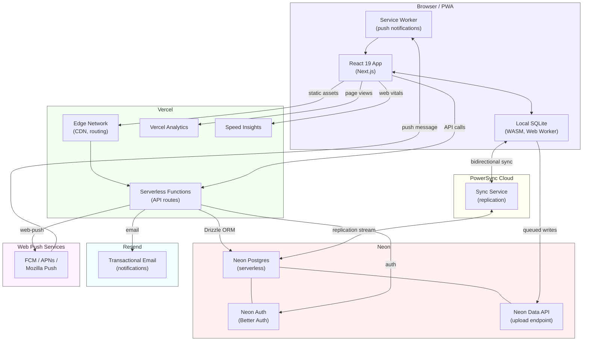

# Infrastructure Diagram

Overview of The Magic Lab's cloud infrastructure and service dependencies.

```mermaid
graph TB
    subgraph Browser["Browser / PWA"]
        SW["Service Worker<br/>(push notifications)"]
        SQLite["Local SQLite<br/>(WASM, Web Worker)"]
        React["React 19 App<br/>(Next.js)"]
        React <--> SQLite
        SW --> React
    end

    subgraph Vercel["Vercel"]
        Edge["Edge Network<br/>(CDN, routing)"]
        Serverless["Serverless Functions<br/>(API routes)"]
        Analytics["Vercel Analytics"]
        Insights["Speed Insights"]
        Edge --> Serverless
    end

    subgraph Neon["Neon"]
        Postgres["Neon Postgres<br/>(serverless)"]
        NeonAuth["Neon Auth<br/>(Better Auth)"]
        NeonDataAPI["Neon Data API<br/>(upload endpoint)"]
        Postgres --- NeonAuth
        Postgres --- NeonDataAPI
    end

    subgraph PowerSync["PowerSync Cloud"]
        SyncService["Sync Service<br/>(replication)"]
    end

    subgraph Resend["Resend"]
        Email["Transactional Email<br/>(notifications)"]
    end

    subgraph PushService["Web Push Services"]
        FCM["FCM / APNs /<br/>Mozilla Push"]
    end

    React -->|"static assets"| Edge
    React -->|"API calls"| Serverless
    React -->|"page views"| Analytics
    React -->|"web vitals"| Insights

    Serverless -->|"Drizzle ORM"| Postgres
    Serverless -->|"auth"| NeonAuth
    Serverless -->|"email"| Email
    Serverless -->|"web-push"| FCM

    SQLite <-->|"bidirectional sync"| SyncService
    SQLite -->|"queued writes"| NeonDataAPI

    SyncService <-->|"replication stream"| Postgres

    FCM -->|"push message"| SW

    style Browser fill:#f0f0ff,stroke:#666
    style Vercel fill:#f0fff0,stroke:#666
    style Neon fill:#fff0f0,stroke:#666
    style PowerSync fill:#fffff0,stroke:#666
    style Resend fill:#f0ffff,stroke:#666
    style PushService fill:#fff0ff,stroke:#666
```
