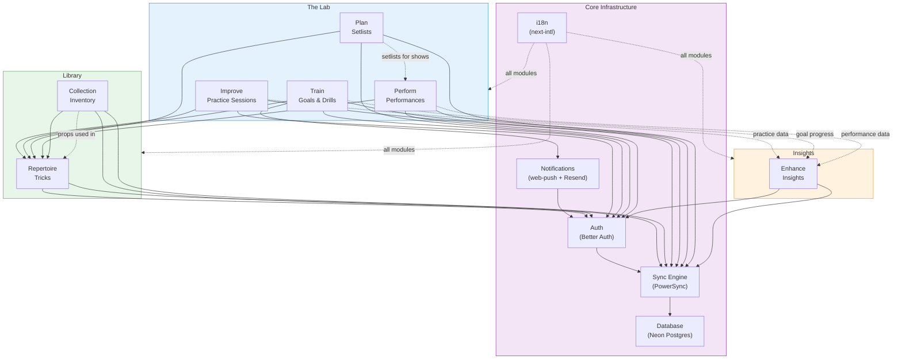

# Module Dependencies Diagram

Feature module dependency graph showing how modules relate to each other and shared infrastructure.



## Module Descriptions

| Module | Group | Purpose | Key Entities |
|---|---|---|---|
| **Repertoire** | Library | Manage trick library with tags and metadata | tricks, trick_tags |
| **Collection** | Library | Manage inventory of props and materials | items, item_tricks |
| **Improve** | Lab | Log practice sessions, track skill progress | practice_sessions, practice_session_tricks |
| **Train** | Lab | Set goals, create drills, build streaks | goals |
| **Plan** | Lab | Build setlists for shows | setlists, setlist_tricks |
| **Perform** | Lab | Log performances, review feedback | performances |
| **Enhance** | Insights | Analytics, insights, improvement suggestions | Reads from all modules |

## Central Entity: Tricks (Repertoire)

The `tricks` table (managed by the Repertoire module) is the central entity shared across modules:

- **Collection**: Items (props) are linked to tricks that use them
- **Improve**: Practice sessions reference tricks being practiced
- **Train**: Goals can target specific tricks
- **Plan**: Setlists are ordered collections of tricks
- **Perform**: (Indirect) Performances use setlists which contain tricks

## Data Flow

```
Library:  Collection (items) --> Repertoire (tricks) <-- Improve (practice)  :Lab
                                       ^
                                       |
                               Plan (setlists) --> Perform (shows)          :Lab
                                       ^
                                       |
                                 Train (goals)                              :Lab
                                       |
                                       v
                                Enhance (insights) <-- All modules          :Insights
```
