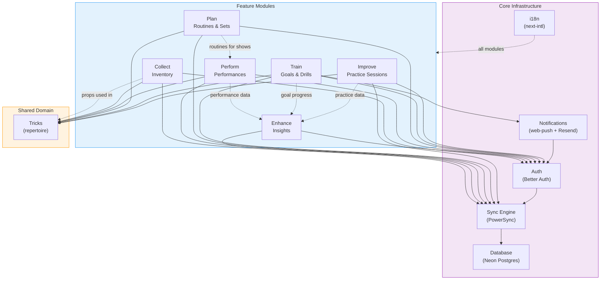

# Module Dependencies Diagram

Feature module dependency graph showing how modules relate to each other and shared infrastructure.



## Module Descriptions

| Module | Purpose | Key Entities |
|---|---|---|
| **Improve** | Log practice sessions, track skill progress | practice_sessions, practice_session_tricks |
| **Train** | Set goals, create drills, build streaks | goals |
| **Plan** | Build routines and setlists | routines, routine_tricks |
| **Perform** | Log performances, review feedback | performances |
| **Enhance** | Analytics, insights, improvement suggestions | Reads from all modules |
| **Collect** | Manage inventory of props and materials | items, item_tricks |

## Shared Domain: Tricks

The `tricks` table is the central entity shared across modules:

- **Improve**: Practice sessions reference tricks being practiced
- **Train**: Goals can target specific tricks
- **Plan**: Routines are ordered collections of tricks
- **Perform**: (Indirect) Performances use routines which contain tricks
- **Collect**: Items (props) are linked to tricks that use them

## Data Flow

```
Collect (items) --> Tricks <-- Improve (practice)
                      ^
                      |
              Plan (routines) --> Perform (shows)
                      ^
                      |
                Train (goals)
                      |
                      v
                Enhance (insights) <-- All modules
```
