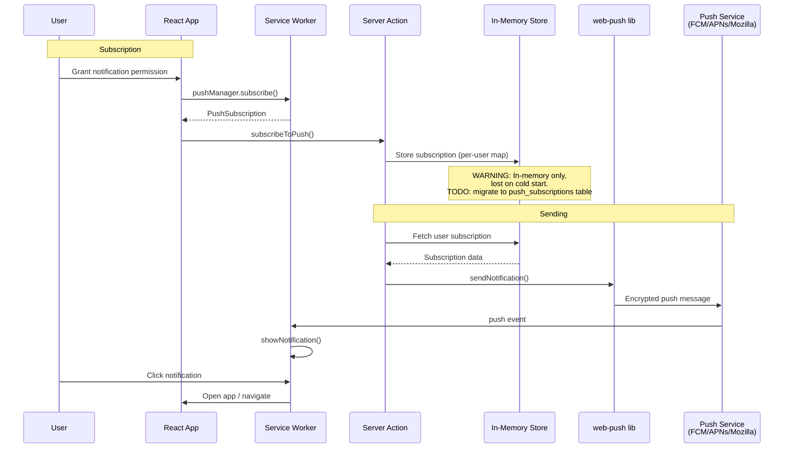
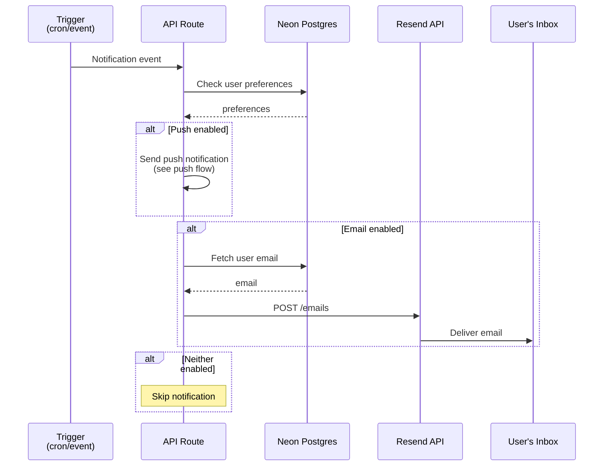
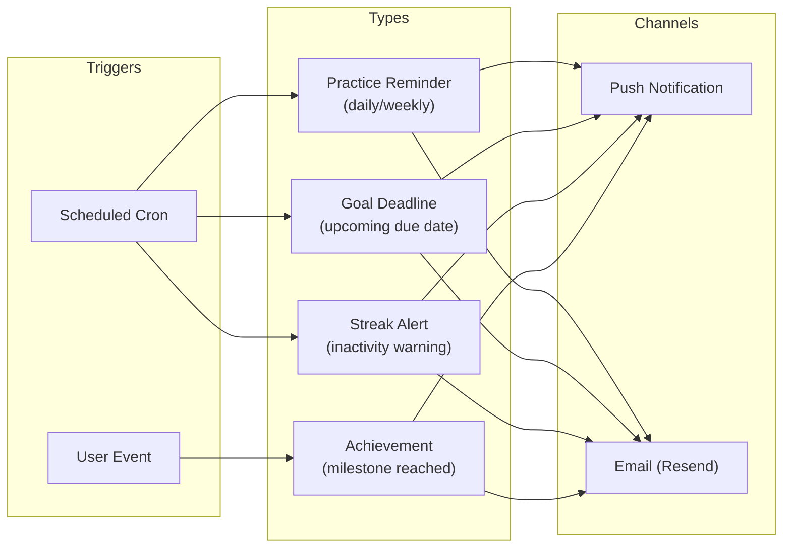

# Notification Flow Diagram

Push notification and email notification flow for The Magic Lab.

## Push Notification Flow

```mermaid
sequenceDiagram
    participant User
    participant App as React App
    participant SW as Service Worker
    participant Action as Server Action
    participant Memory as In-Memory Store
    participant WebPush as web-push lib
    participant PushSvc as Push Service<br/>(FCM/APNs/Mozilla)

    Note over User,App: Subscription

    User->>App: Grant notification permission
    App->>SW: pushManager.subscribe()
    SW-->>App: PushSubscription
    App->>Action: subscribeToPush()
    Action->>Memory: Store subscription (per-user map)
    Note over Memory: WARNING: In-memory only,<br/>lost on cold start.<br/>TODO: migrate to push_subscriptions table

    Note over Action,PushSvc: Sending

    Action->>Memory: Fetch user subscription
    Memory-->>Action: Subscription data
    Action->>WebPush: sendNotification()
    WebPush->>PushSvc: Encrypted push message
    PushSvc->>SW: push event
    SW->>SW: showNotification()
    User->>SW: Click notification
    SW->>App: Open app / navigate
```

## Email Fallback Flow

```mermaid
sequenceDiagram
    participant Trigger as Trigger<br/>(cron/event)
    participant API as API Route
    participant DB as Neon Postgres
    participant Resend as Resend API
    participant Inbox as User's Inbox

    Trigger->>API: Notification event
    API->>DB: Check user preferences
    DB-->>API: preferences

    alt Push enabled
        API->>API: Send push notification<br/>(see push flow)
    end

    alt Email enabled
        API->>DB: Fetch user email
        DB-->>API: email
        API->>Resend: POST /emails
        Resend->>Inbox: Deliver email
    end

    alt Neither enabled
        Note over API: Skip notification
    end
```

## Notification Types

```mermaid
graph LR
    subgraph Triggers
        Cron["Scheduled Cron"]
        Event["User Event"]
    end

    subgraph Types
        PR["Practice Reminder<br/>(daily/weekly)"]
        GD["Goal Deadline<br/>(upcoming due date)"]
        SA["Streak Alert<br/>(inactivity warning)"]
        AV["Achievement<br/>(milestone reached)"]
    end

    subgraph Channels
        Push["Push Notification"]
        Email["Email (Resend)"]
    end

    Cron --> PR
    Cron --> GD
    Cron --> SA
    Event --> AV

    PR --> Push
    PR --> Email
    GD --> Push
    GD --> Email
    SA --> Push
    SA --> Email
    AV --> Push
    AV --> Email
```
