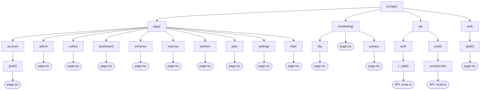

# Route Map

<!-- Last verified: 2026-03-20 -->

## Route Structure

## Route Groups

### `(marketing)/` — Public Pages
- `/` — Landing page (hero, features, CTAs)
- `/privacy` — Privacy policy
- `/faq` — Frequently asked questions

### `(app)/` — Authenticated App
- `/dashboard` — Main dashboard
- `/improve` — Practice session logging
- `/train` — Goal setting and drills
- `/plan` — Routine builder
- `/perform` — Performance tracking
- `/enhance` — Insights and suggestions
- `/collect` — Inventory management
- `/settings` — User preferences
- `/account/[path]` — Neon Auth account management
- `/admin` — Admin dashboard (role-restricted)

### `auth/` — Auth Pages
- `/auth/[path]` — Sign-in, sign-up (Neon Auth UI)

### `api/` — API Routes
- `/api/auth/[...path]` — Neon Auth (Better Auth) catch-all
- `/api/email/unsubscribe` — Email unsubscribe endpoint
