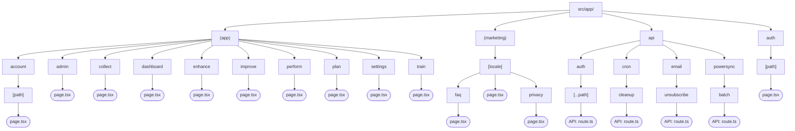

# Route Map

<!-- Last verified: 2026-03-24 -->

## Route Structure

## Route Groups

### `(marketing)/[locale]/` — Public Pages (statically generated)
- `/[locale]` — Landing page (hero, features, CTAs) — 7 locale variants
- `/[locale]/privacy` — Privacy policy — 7 locale variants
- `/[locale]/faq` — Frequently asked questions — 7 locale variants
- Bare paths (`/`, `/faq`, `/privacy`) are 302-redirected by proxy to locale-prefixed versions

### `(app)/` — Authenticated App
- `/dashboard` — Main dashboard
- `/improve` — Practice session logging
- `/train` — Goal setting and drills
- `/plan` — Routine builder
- `/perform` — Performance tracking
- `/enhance` — Insights and suggestions
- `/collect` — Inventory management
- `/settings` — User preferences
- `/account/[path]` — Neon Auth account management
- `/admin` — Admin dashboard (role-restricted)

### `auth/` — Auth Pages
- `/auth/[path]` — Sign-in, sign-up (Neon Auth UI)

### `api/` — API Routes
- `/api/auth/[...path]` — Neon Auth (Better Auth) catch-all
- `/api/email/unsubscribe` — Email unsubscribe endpoint
