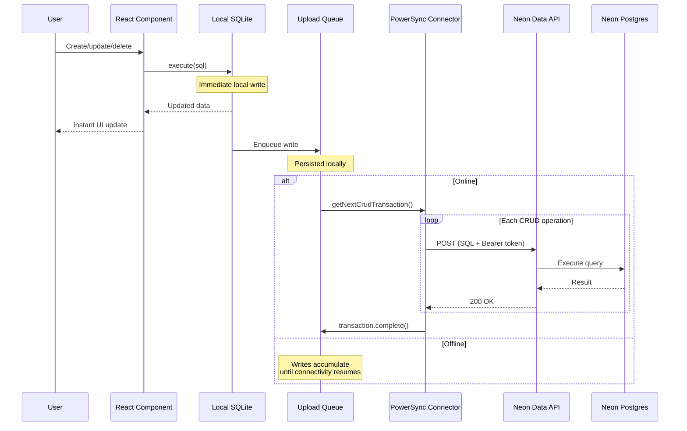
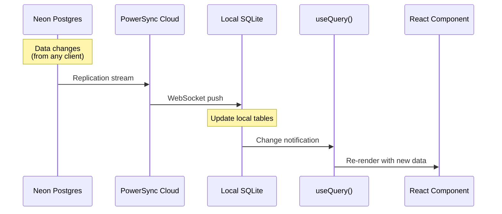
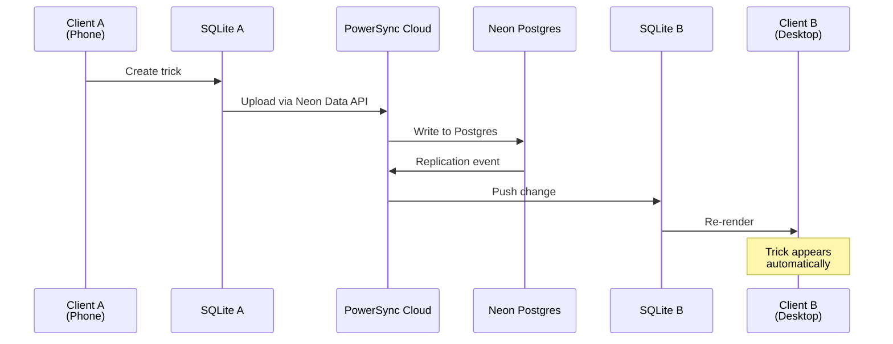
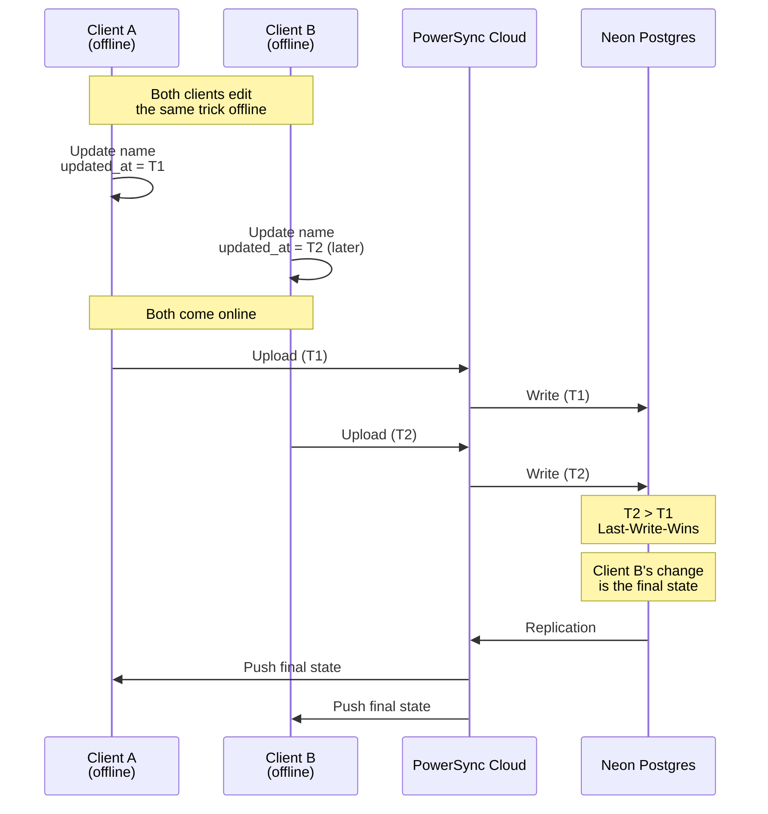

# Sync Flow Diagram

Sequence diagram showing the offline-first data synchronization flow.

## Write Flow (Client to Server)

## Read Flow (Server to Client)

## Multi-Client Sync

## Conflict Resolution

